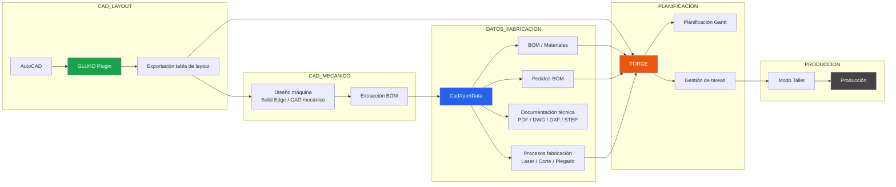

# Megiddo Source


---
[](https://github.com/Megiddo-Source/Forge)
[](https://github.com/Megiddo-Source/CadXportData)
[](https://github.com/Megiddo-Source/GLUKO)


Industrial engineering software ecosystem.

Megiddo Source desarrolla herramientas para automatizar el flujo técnico entre **CAD, planificación, producción y documentación industrial**.


---

```markdown
## Suite de software

### FORGE
Planificación industrial basada en tareas, dependencias y gestión de proyectos de fabricación.

### CADXPORTDATA
Gestión de BOM, documentación técnica (PDF / DWG / DXF / STEP) y coordinación entre ingeniería y producción.

### GLUKO
Plugin para AutoCAD orientado a ingeniería de layout industrial y generación automática de tablas técnicas.
```
---
## Aplicaciones


### FORGE
Planificación industrial basada en tareas y dependencias.

[](https://github.com/Megiddo-Source/Forge)

---


### CADXPORTDATA
Gestión de datos técnicos, BOM y documentación de fabricación.

[](https://github.com/Megiddo-Source/CadXportData)

---

### GLUKO
Plugin para AutoCAD orientado a layout industrial.

[](https://github.com/Megiddo-Source/GLUKO)


---

# Arquitectura del sistema



---

# Filosofía

Reducir trabajo manual en ingeniería industrial mediante herramientas que conectan:

```
CAD → Datos → Planificación → Producción
```

---

# Estado

Proyecto en desarrollo activo.
---


---
