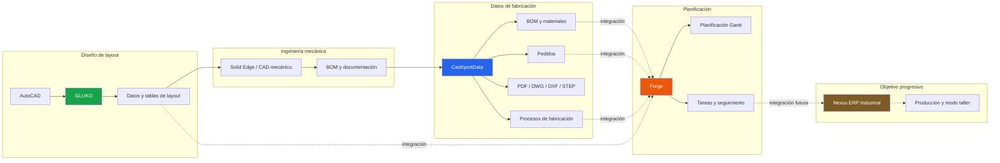

<div align="center">

# MEGIDDO SOURCE


### Software especializado para trabajar, crear y automatizar en local.

Megiddo Source desarrolla proyectos de software centrados en productividad,  
IA local, automatización, herramientas CAD y entornos industriales.

[Sitio web](https://megiddosource.netlify.app/)
·
[Proyectos](https://megiddosource.netlify.app/apps/)
·
[Nexus ERP Industrial](https://megiddosource.netlify.app/ecosystem.html)
·
[Distribución](https://megiddosource.netlify.app/downloads.html)

</div>

---


## Sobre Megiddo Source

Megiddo Source es una iniciativa independiente de desarrollo de software.

Los proyectos se crean para resolver problemas concretos y pueden adoptar distintas formas:

- aplicaciones de escritorio;
- aplicaciones móviles;
- herramientas de IA local;
- extensiones de navegador;
- utilidades técnicas;
- proyectos industriales;
- prototipos e investigación.

La mayoría de los proyectos funcionan de manera independiente.

Actualmente, **Nexus ERP Industrial** es el único ecosistema formal en desarrollo dentro de Megiddo Source.

---

# Nexus ERP Industrial

Nexus ERP Industrial es una plataforma industrial en desarrollo para conectar progresivamente:

```text
CAD → Datos técnicos → Planificación → Producción
```

Está formada actualmente por tres proyectos principales:

## CadXportData

Automatización de BOM, documentación técnica, archivos CAD y datos de fabricación.

[](https://github.com/Megiddo-Source/CadXportData)

## Forge

Planificación de proyectos industriales, tareas, dependencias y seguimiento de producción.

[](https://github.com/Megiddo-Source/Forge)

## GLUKO

Herramientas para AutoCAD orientadas a bloques, atributos, tablas y automatización de layouts industriales.

[](https://github.com/Megiddo-Source/GLUKO)

> Los tres proyectos pueden funcionar de forma independiente mientras avanza la integración progresiva de Nexus ERP Industrial.

---

## Arquitectura prevista de Nexus ERP Industrial



### Leyenda

- Línea continua: flujo o capacidad actual.
- Línea discontinua: integración progresiva o prevista.
- Nexus ERP Industrial: objetivo de plataforma conjunta.

---

# Otros proyectos

Megiddo Source también desarrolla aplicaciones y herramientas independientes relacionadas con:

- IA local;
- productividad personal;
- desarrollo asistido;
- visualización CAD;
- automatización de navegador;
- doblaje y traducción local;
- generación multimedia;
- experiencias narrativas.

El catálogo público, el estado y la distribución de cada proyecto se mantienen en el sitio web:

[Explorar todos los proyectos](https://megiddosource.netlify.app/apps/)

No todos los proyectos disponen de repositorio público.

---

# Filosofía de desarrollo

Megiddo Source prioriza:

- software especializado frente a aplicaciones genéricas;
- procesamiento local cuando resulta viable;
- control del usuario sobre sus datos;
- automatización de trabajos repetitivos;
- aplicaciones independientes y modulares;
- integración únicamente cuando aporta un valor real;
- transparencia sobre el estado de desarrollo.

Compartir autor, tecnologías o filosofía no convierte automáticamente varios proyectos en un ecosistema.

---

# Estado de los proyectos

Los proyectos pueden encontrarse en diferentes etapas:

| Estado | Significado |
|---|---|
| Concepto | Dirección inicial definida |
| Investigación | Validación técnica o funcional |
| Prototipo | Implementación experimental |
| Preview | Funcionalidad utilizable todavía en evolución |
| Beta | Proyecto funcional en validación |
| Disponible | Publicación pública utilizable |
| Mantenimiento | Desarrollo centrado en estabilidad y correcciones |

Consulta la ficha de cada proyecto para conocer su estado real.

---

# Distribución

Megiddo Source no utiliza GitHub como única vía de distribución.

Según el proyecto, las publicaciones pueden encontrarse en:

- GitHub Releases;
- Gumroad;
- Chrome Web Store;
- Microsoft Edge Add-ons;
- Google Play;
- Autodesk App Store;
- otros distribuidores indicados en la web oficial.

[Consultar distribución oficial](https://megiddosource.netlify.app/downloads.html)

---

<div align="center">


**Megiddo Source**

Software especializado. Automatización práctica. Control local.

</div>
