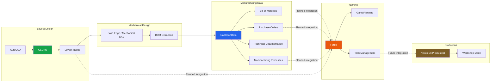

<div align="center">

# MEGIDDO SOURCE


### Specialized software for productivity, local AI, automation, and industrial engineering.

Megiddo Source develops independent software projects focused on local-first computing,
technical productivity, automation, CAD workflows, and industrial solutions.

<div align="center">

[](https://megidddosource.netlify.app)

[](https://megidddosource.netlify.app/apps/)

[](https://megidddosource.netlify.app/ecosystem.html)

[](https://megidddosource.netlify.app/downloads.html)

</div>
</div>

---


---

# About Megiddo Source

Megiddo Source is an independent software development initiative focused on building practical tools for professionals, creators, and local AI users.

Projects may include:

- Desktop applications
- Mobile applications
- Local AI tools
- Browser extensions
- CAD utilities
- Industrial software
- Automation tools
- Experimental research projects

Most applications are designed to work independently.

Currently, **Nexus ERP Industrial** is the primary ecosystem under active development inside Megiddo Source.

---

# Nexus ERP Industrial

Nexus ERP Industrial is a long-term industrial software platform designed to progressively connect engineering and manufacturing workflows.

Its objective is to integrate:

```text
CAD → Technical Data → Planning → Production
```

The ecosystem currently consists of three core applications.

---

## Forge

Industrial project planning with Gantt scheduling, task management, and production tracking.

[](https://github.com/Megiddo-Source/Forge)

---

## CadXportData

Technical data management for manufacturing, including BOM processing, engineering documentation, and production assets.

[](https://github.com/Megiddo-Source/CadXportData)

---

## GLUKO

AutoCAD productivity tools focused on layout engineering, block libraries, attribute automation, and technical table generation.

[](https://github.com/Megiddo-Source/GLUKO)

---

> These applications are fully usable as standalone products while progressively evolving toward the Nexus ERP Industrial ecosystem.

---

# Planned Nexus ERP Industrial Architecture



---

## Legend

- **Solid lines** represent implemented or currently available workflows.
- **Dashed lines** represent planned or progressive integrations.
- **Nexus ERP Industrial** represents the long-term integration goal.

---

# Other Projects

Besides Nexus ERP Industrial, Megiddo Source develops independent software in areas such as:

- Local Artificial Intelligence
- Desktop Productivity
- Development Tools
- CAD Viewers
- Browser Extensions
- Translation & Local Dubbing
- Multimedia Generation
- Storytelling Platforms
- Experimental Utilities

Not every project has a public repository.

The complete public catalog is available on the official website.

---

# Development Philosophy

Megiddo Source follows a few core principles:

- Local-first software whenever practical
- User control over data
- Automation of repetitive workflows
- Modular, standalone applications
- Integration only when it adds real value
- Clear project status and transparent development
- Practical tools over unnecessary complexity

Sharing the same author or technology does not automatically make separate projects part of the same ecosystem.

---

# Project Status

Projects may be found in different development stages:

| Status | Description |
|---------|-------------|
| Concept | Initial direction defined |
| Research | Technical validation |
| Prototype | Experimental implementation |
| Preview | Usable but evolving |
| Beta | Feature-complete with ongoing validation |
| Stable | Publicly available |
| Maintenance | Stability improvements and bug fixes |

Each project documents its own development status.

---

# Distribution

Depending on the project, releases may be available through:

- GitHub Releases
- Gumroad
- Chrome Web Store
- Microsoft Edge Add-ons
- Google Play
- Autodesk App Store
- Additional official distribution channels

---

<div align="center">


**Megiddo Source**

*Specialized Software • Local AI • Industrial Automation*

</div>
